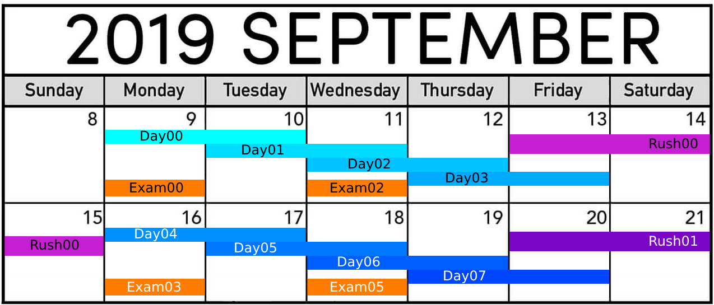

# Rundown
<table>
  <tr></tr>
  <tr>
      <th>Day00</th>
      <th>Day01</th>
      <th>Day02</th>
      <th>Day03</th>
  </tr>
  <tr>
    <td><ul>
<li>-[x] <code>ex00</code> naive search</li>
<li>-[x] <code>ex01</code> sort array</li>
<li>-[x] <code>ex02</code> binary search/half-interval search</li>
<li>-[x] <code>ex03</code> hash table</li>
<li>-[x] <code>ex04</code> Karp-Rabin string-search</li>
<li>-[ ] <code>ex05</code></li>
<li>-[ ] <code>ex06</code></li>
<li>-[ ] <code>ex07</code></li>
<li>-[ ] <code>ex08</code></li>
    </ul></td>
    <td><ul>
<li>-[ ] <code>ex00</code> circular doubly linked list</li>
<li>-[ ] <code>ex01</code> singularly linked list</li>
<li>-[ ] <code>ex02</code> stack</li>
<li>-[ ] <code>ex03</code> singularly linked list</li>
<li>-[ ] <code>ex04</code> queue</li>
<li>-[ ] <code>ex05</code> stack</li>
<li>-[ ] <code>ex06</code> singularly linked list</li>
<li>-[ ] <code>ex07</code> weird doubly linked list</li>
<li>-[ ] <code>ex08</code> weird doubly linked list</li>
    </ul></td>
    <td><ul>
<li>-[x] <code>ex00</code> bubble sort</li>
<li>-[x] <code>ex01</code> insertion sort</li>
<li>-[x] <code>ex02</code> quick sort</li>
<li>-[x] <code>ex03</code> merge sort</li>
<li>-[x] <code>ex04</code> count sort</li>
<li>-[x] <code>ex05</code> binary search with rotated array</li>
<li>-[x] <code>ex06</code> radix sort</li>
<li>-[ ] <code>ex07</code> divide and conquer</li>
<li>-[ ] <code>ex08</code> external sort</li>
<li>-[ ] <code>ex09</code></li>
    </ul></td>
    <td><ul>
<li>-[ ] <code>ex00</code> binary search tree</li>
<li>-[ ] <code>ex01</code> binary search tree</li>
<li>-[ ] <code>ex02</code> n-ary tree</li>
<li>-[ ] <code>ex03</code> min-heap and max-heap</li>
<li>-[ ] <code>ex04</code> max-heap</li>
<li>-[ ] <code>ex05</code> trie/prefix tree</li>
    </ul></td>
  </tr>
  <tr>
      <th>Day04</th>
      <th>Day05</th>
      <th>Day06</th>
      <th>Day07</th>
  </tr>
  <tr>
    <td><ul>
<li>-[ ] <code>ex00</code> addition</li>
<li>-[ ] <code>ex01</code> <code>&</code> and <code>|</code></li>
<li>-[ ] <code>ex02</code> bitshift</li>
<li>-[ ] <code>ex03</code> xor</li>
<li>-[ ] <code>ex04</code> check index bit</li>
<li>-[ ] <code>ex05</code> unset bit</li>
<li>-[ ] <code>ex06</code></li>
<li>-[ ] <code>ex07</code></li>
<li>-[ ] <code>ex08</code></li>
<li>-[ ] <code>ex09</code></li>
<li>-[ ] <code>ex10</code></li>
<li>-[ ] <code>ex11</code></li>
<li>-[ ] <code>ex12</code></li>
<li>-[ ] <code>ex13</code></li>
<li>-[ ] <code>ex14</code></li>
<li>-[ ] <code>ex15</code></li>
<li>-[ ] <code>ex16</code></li>
<li>-[ ] <code>ex17</code></li>
<li>-[ ] <code>ex18</code></li>
<li>-[ ] <code>ex19</code></li>
<li>-[ ] <code>ex20</code></li>
    </ul></td>
    <td><ul>
<li>-[ ] <code>ex00</code></li>
<li>-[ ] <code>ex01</code></li>
<li>-[ ] <code>ex02</code></li>
<li>-[ ] <code>ex03</code></li>
<li>-[ ] <code>ex04</code></li>
<li>-[ ] <code>ex05</code></li>
<li>-[ ] <code>ex06</code></li>
<li>-[ ] <code>ex07</code></li>
<li>-[ ] <code>ex08</code></li>
    </ul></td>
    <td><ul>
<li>-[ ] <code>ex00</code></li>
<li>-[ ] <code>ex01</code></li>
<li>-[ ] <code>ex02</code></li>
<li>-[ ] <code>ex03</code></li>
<li>-[ ] <code>ex04</code></li>
<li>-[ ] <code>ex05</code></li>
<li>-[ ] <code>ex06</code></li>
    </ul></td>
    <td><ul>
<li>-[ ] <code>ex00</code></li>
<li>-[ ] <code>ex01</code></li>
<li>-[ ] <code>ex02</code></li>
<li>-[ ] <code>ex03</code></li>
<li>-[ ] <code>ex04</code></li>
<li>-[ ] <code>ex05</code></li>
    </ul></td>
  </tr>
</table>
